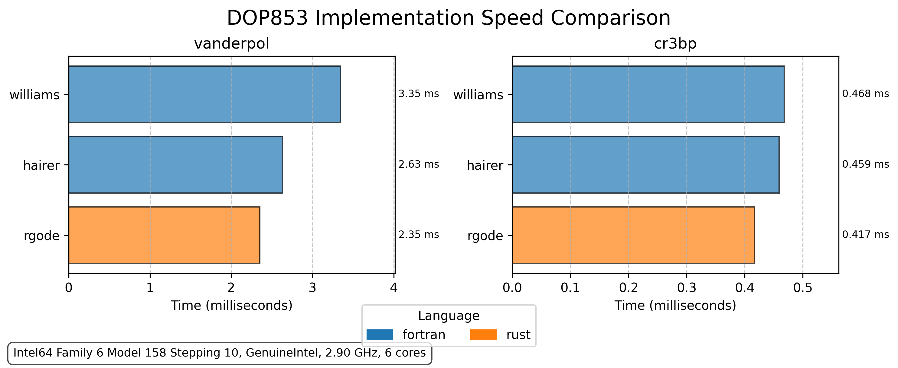

# RGODE-Benchmarks

This submodule of rgode contains benchmarks comparing the rgode Rust ODE solver against implementations in other programming languages. These scripts are used primarily to compare the speed and accuracy of the Rust implementation against other languages, mainly Fortran, which has long been the standard bearer in scientific computing.

Currently, only the `DOP853` solver is being benchmarked as it is the flagship solver of the rgode library with widespread use in the scientific community due to its high accuracy and efficiency. Implementations of this solver can be easily found in other languages such as Fortran and Python. Note the a comparison of other solvers in the `rgode` library vs different languages would likely yield a similar performance difference and thus the scope of this benchmark is limited to the `DOP853` solver currently for brevity.

## Sample Benchmark

The following results were obtained on a Windows 10 machine with an Intel i5-9400F CPU @ 2.90Ghz and 16GB of RAM @ 2133Mhz. The benchmarks were run with the following `config.json`:

```json
{
    "repeats": 100,
    "problems": ["vanderpol", "cr3bp"],
    "languages": ["rust", "python", "fortran"],
    "problem_settings": {
        "vanderpol": {
            "mu": 0.2,
            "t0": 0.0,
            "tf": 1000.0,
            "y0": [0.0, 0.1],
            "atol": 1e-12,
            "rtol": 1e-12
        },
        "cr3bp": {
            "mu": 0.012150585609624,
            "t0": 0.0,
            "tf": 10.0,
            "y0": [1.021881345465263, 0.0, -0.182000000000000, 0.0, -0.102950816739606, 0.0],
            "atol": 1e-12,
            "rtol": 1e-12
        }
    }
}
```

The plot was generated using matplotlib with the python implementation not shown due to its low performance as it mainly serves as a reference point.



As can be seen, the Rust implementation is $\approx$ 10% faster for the Van der Pol Oscillator and $\approx$ 9% faster for the Circular Restricted Three Body Problem (CR3BP) compared to the fastest Fortran implementation. This test was run with level 3 optimizations (-O3) and native cpu optimization was enabled for both Rust and Fortran. Extreme care was taken to ensure that both implementations were optimized for an accurate comparison. 

Please share your own results of this test as the differences in performance per operating system and hardware could gives results more or less favorable to Rust so expect some variance to the results shown here.

An interesting takeaway from this is that the `rgode` library was designed to be high performance avoiding dynamic dispatch and heap allocations as much as possible. But despite this the main focus was on the ergonomics of the library and the ease of use. Thankfully it seems evident that Rust's type system and ownership model allows for high performance code to be created while taking advantage of ergonomic language features not requiring excessive consideration for performance while writing code besides simple design decisions.

## Running Benchmarks


A Python script is provided which will run the benchmarks according to the settings in `config.json`. To run the benchmarks:

```bash
python run_benchmarks.py
```

## Interpreting Results

Results are saved in the `target/results/` directory as JSON files. These files contain detailed performance metrics and solver accuracy data that can be used to generate comparative plots.

```bash
python plot_benchmark_results.py path_to_results_file.json --exclude python
```

Note that the `--exclude` flag can be used to exclude a language from the plot. This is most useful for python as it is significantly slower due to being an interpreted language (despite making use of Fortran for `DOP853` via SciPy).

## Adding New Benchmarks

To add a new benchmark problem:

1. Create a directory under problems/ (e.g., problems/{problem_name}/)
2. Implement the problem in your desired languages (Rust, Fortran, Python, etc.) using the pre-existing problems as a guide
3. Update the `config.json` file with the new problem details