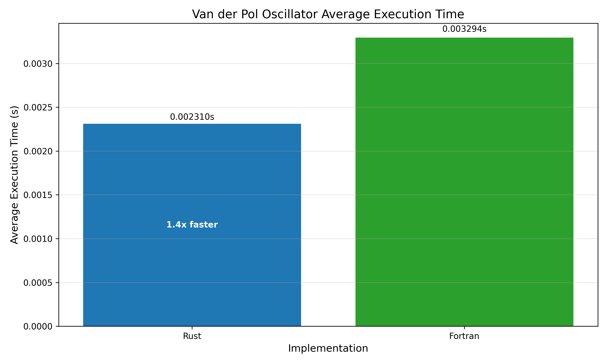
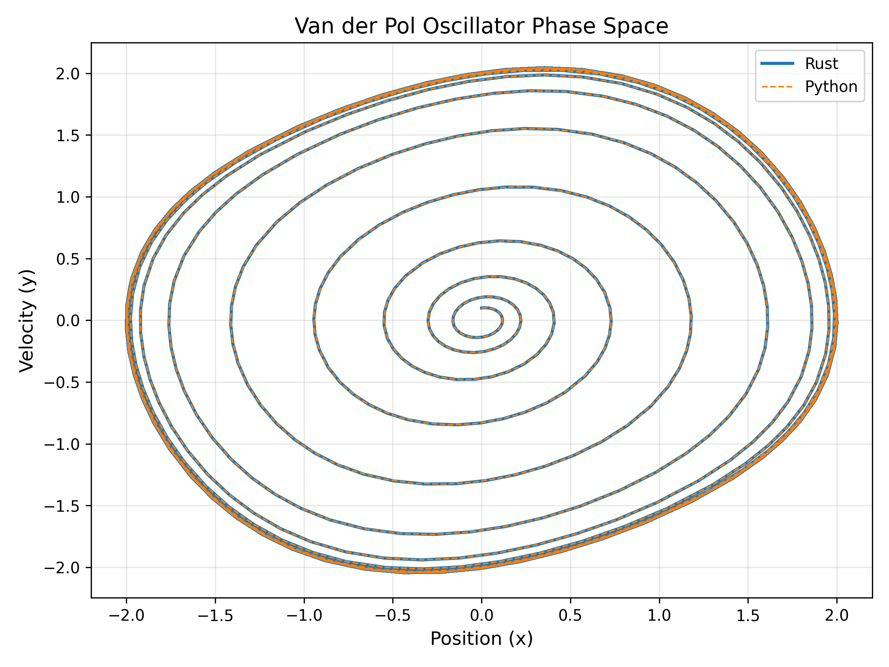

# Van der Pol Oscillator Benchmark Results

This directory contains benchmark results for solving the Van der Pol oscillator using the DOP853 method implemented in `rgode`, `scipy`, and origional and modern fortran implementations.

## Problem Description

The Van der Pol oscillator is a non-conservative oscillator with non-linear damping, described by the second-order differential equation:

```
d²x/dt² - μ(1 - x²)dx/dt + x = 0
```

Where μ is a scalar parameter indicating the non-linearity and strength of the damping.

## Computer Specifications

The benchmarks were run on the following system:

- **CPU**: Intel Core i5-9400F CPU @ 2.90GHz
- **RAM**: 16GB DDR4
- **OS**: Windows 10

## Build Settings

- Python: Python 3.13.1
- Rust: rustc 1.85.0, built with `--release`
- Fortran: gfortran 13.1.0, built with `-O3`

## Performance Comparison

The following chart shows the average execution times for different numerical methods:



Only the Rust and Fortran implementations are included as the python is significantly slower as expected. As shown in the chart the `rgode` Rust implementation is the faster.

## Solution Accuracy

To verify that all methods produce correct results, we plotted the phase space diagram of the oscillator:



The phase space plot demonstrates that all numerical methods converge to the same limit cycle, which is characteristic of the Van der Pol oscillator. This confirms that while performance varies, the numerical accuracy is consistent across methods.